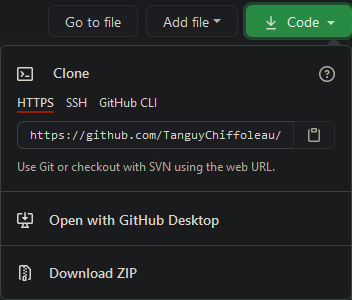
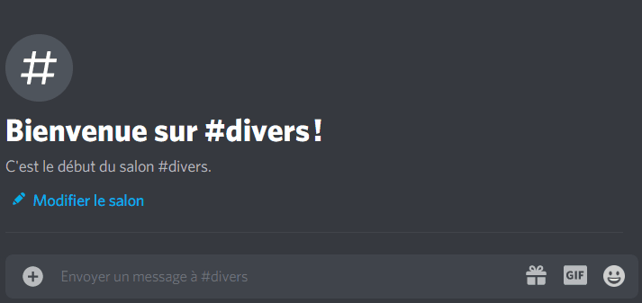

# Le-bot-en-JS

[](https://github.com/TanguyChiffoleau/Le-bot-en-JS/releases)

## Table des matières

- [Table des matières](#table-des-matières)
- [À propos](#à-propos)
- [Mise en place du bot](#mise-en-place-du-bot)
	- [Création du bot](#création-du-bot)
	- [Invitation du bot](#invitation-du-bot)
- [Setup en production](#setup-en-production)
	- [Setup avec Node.js](#setup-avec-nodejs)
	- [Setup dans un container avec Docker et Docker Compose](#setup-dans-un-container-avec-docker-et-docker-compose)
- [Ressources](#ressources)
- [Contribuer](#contribuer)

## À propos

Le-bot-en-JS est un bot discord open-source codé en JS conçu principalement et spécialement pour le serveur discord **Entraide Informatique - Capet & CTRL-F**.

[](https://www.discord.gg/informatique)

## Mise en place du bot

### Création du bot

[Cliquez ici](https://discordjs.guide/preparations/setting-up-a-bot-application.html#creating-your-bot) pour accéder à un tutoriel (en anglais) tiré du [guide officiel de Discord.js](https://discordjs.guide/) pour créer votre bot.

Une fois le bot créé, dans la section "Bot", il faudra activer l'intent privilégié "SERVER MEMBERS INTENT". Si votre bot n'est pas vérifié, il faut simplement activer le bouton. Sinon, voici quelques ressources pour activer les intents : [Discords FAQ](https://dis.gd/gwupdate), [Discord Support](https://dis.gd/contact).

Une fois votre application et bot créés, vous devez récupérer le token du bot ("TOKEN") ainsi que l'ID de l'application ("APPLICATION ID").

### Invitation du bot

Pour inviter le bot sur un serveur, il faut créer un lien d'invitation. Il est nécessaire d'avoir l'ID du client. Voici le lien type utilisé pour ce bot : `https://discord.com/oauth2/authorize?client_id=INSERT_CLIENT_ID_HERE&scope=bot&permissions=419540176`.

> Remplacez `INSERT_CLIENT_ID_HERE` par l'ID de votre application.

> `permissions=419540176` correspond aux permissions d'invitation du bot. Vous pouvez modifier le code des permissions avec un [calculateur de permissions](https://discordapi.com/permissions.html). `419540176` accorde au bot les permissions suivantes : Manage Channels, Manage Roles, View Audit Log, Manage Nicknames, Read Messages, Send Messages, Attach Files, Add Reactions, Manage Messages, Read Message History, View Channel, Move Members. Veuillez noter qu'il est nécessaire d'avoir [l'authentification à deux facteurs](https://support.discord.com/hc/fr/articles/219576828-Mise-en-place-de-l-authentification-%C3%A0-deux-facteurs) activée sur le compte du propriétaire du bot pour utiliser les permissions suivantes : Manage Channels, Manage Roles, Manage Messages.

## Setup en production

L'application est capable de tourner sous plusieurs environnements :

- n'importe quel environnement avec Node.js d'installé
- dans un container Docker avec Docker Compose

### Setup avec Node.js

#### Prérequis

1. Il est nécessaire d'avoir [Node.js](https://nodejs.org/fr/) 16.6.0 ou plus récent d'installé sur votre machine.

	> Utilisez la commande `node -v` pour vous assurez que Node est bien installé et que sa version est suffisante.

	> À titre indicatif, l'application tourne sous Node.js v14.16.0 en production.

2. Téléchargez le code de l'application sur votre machine. _cf. [Télécharger le code de l'application sur votre machine](#download)_

3. Il faut au préalable installer les dépendances de l'application avant de lancer celle-ci en utilisant la commande `npm i`.

	> Toutes les dépendances vont être installées, y compris celles prévues pour les développeurs, car le package [dotenv](https://www.npmjs.com/package/dotenv) est nécessaire. Ci toutefois vous avez appliqué les variables d'environnement à l'application par vos propres moyens, seule la commande `npm i --production` est nécessaire.

4. Renommez le fichier `bot.example.env` en `bot.env`, puis modifiez les variables d'environnement pour que l'application fonctionne correctement. _cf. [Variables d'environnement](#environnement)_

5. Renommez le fichier `database.example.env` en `database.env`, puis modifiez son contenu pour que le système fonctionne correctement. _cf. [Variables d'environnement](#environnement)_

6. Renommez le fichier `reactionRoleConfig.example.json` en `reactionRoleConfig.json`, puis modifiez son contenu pour que le système fonctionne correctement. _cf. [Variables d'environnement](#environnement)_

7. Renommez le fichier `banEmotesAtJoin.example.json` en `banEmotesAtJoin.json`, puis modifiez son contenu pour que le système fonctionne correctement. _cf. [Variables d'environnement](#environnement)_

#### Lancement et arrêt de l'application

-   Vous pouvez utiliser `npm start` pour lancer l'application.

-   Vous pouvez utiliser la combinaison de touches Ctrl+C ou fermer la fenêtre de commandes pour tuer l'application.

> Vous pouvez utiliser un gestionnaire d'application comme [PM2](https://pm2.keymetrics.io/) pour faciliter la gestion de l'application. _cf. [ Managing your bot process with PM2](https://discordjs.guide/improving-dev-environment/pm2.html)_


### Setup dans un container avec Docker et Docker Compose

#### Prérequis

1. Il est nécessaire d'avoir [Docker](https://docs.docker.com/get-docker/) ainsi que [Docker Compose](https://docs.docker.com/compose/install/) d'installé.
	> Utilisez les commandes `docker -v` et `docker-compose -v` pour vérifier que les deux applications soient bien installées.

2. Créez les fichiers `bot.env`, `reactionRoleConfig.json` et `banEmotesAtJoin.json` dans le dossier `config` ainsi que le fichier `docker-compose.yml` dans le dossier `docker` :
	```bash
	mdkir config
	cd config
	touch bot.env reactionRoleConfig.json banEmotesAtJoin.json
	cd ..
	mkdir docker
	touch docker-compose.yml
	```

   - Configurez le fichier `bot.env` en ajoutant les variables d'environnement pour que l'application fonctionne correctement. _cf. [Variables d'environnement](#environnement)_

   - Configurez le fichier `reactionRoleConfig.json`, puis modifiez le fichier pour que le système fonctionne correctement. _cf. [Configuration du sytème de réaction/rôles](#reaction)_

   - Configurez le fichier `banEmotesAtJoin.json`, puis modifiez le fichier pour que le système fonctionne correctement. _cf. [Configuration du sytème de réaction/rôles](#reaction)_

   - Copiez le contenu du fichier [docker/docker-compose.yml](docker/docker-compose.yml) dans le fichier du même emplacement sur votre machine. Il correspond au fichier de configuration pour `docker-compose`.

> La structure des dossiers et fichiers devrait ressembler à ça :
> ```
> .
> ├── config
> │   ├── bot.env
> │   ├── reactionRoleConfig.json
> │   └── banEmotesAtJoin.json
> └── docker
> 	  └── docker-compose.yml
> ```

#### Lancement de l'application

-   Vous pouvez utiliser les commandes `docker pull tanguychiffoleau/le-bot-en-js:latest` puis `docker-compose --file ./docker/docker-compose.yml --env-file ./config/database.env --project-name le-bot-en-js up --detach` pour lancer l'application.

> docker pull va télécharger ou mettre à jour si besoin l'image de l'application hébergée sur [Docker Hub](https://hub.docker.com/repository/docker/tanguychiffoleau/le-bot-en-js). Le tag ici est `latest` ce qui correspond, de fait, au code présent sur la branche [master](https://github.com/TanguyChiffoleau/Le-bot-en-JS/tree/master/). Vous pouvez spécifier une version spécifique comme par exemple `2.0.0`. _cf. [liste des tags disponibles](https://hub.docker.com/repository/registry-1.docker.io/tanguychiffoleau/le-bot-en-js/tags?page=1) ainsi que leur [version correspondante](https://github.com/TanguyChiffoleau/Le-bot-en-JS/releases)_

> docker-compose va lancer le container avec les règles définies dans `docker-compose.yml`.

> Pour plus d'infos sur les technologies liées à Docker utilisées ici, vous pouvez consulter leur [documentation](https://docs.docker.com/reference/) ou leur [manuel](https://docs.docker.com/engine/).

#### Arrêt de l'application

-   Vous pouvez utiliser la commande `docker-compose -f ./docker/docker-compose.yml stop` pour stopper le container. Pour le supprimer, utilisez la commande `docker-compose -f ./docker/docker-compose.yml down`.

## Ressources

</details>

<details id='download'>
<summary><b>Télécharger le code de l'application sur votre machine</b></summary>

Vous pouvez télécharger le code de l'application sur votre machine

-   en [clonant le repository](https://docs.github.com/en/free-pro-team@latest/github/creating-cloning-and-archiving-repositories/cloning-a-repository)
-   ou en téléchargeant le code source



</details>

<details id='environnement'>
<summary><b>Variables d'environnement</b></summary>

Le bot repose sur les variables d'environnement pour pouvoir fonctionner.

#### Fichier bot.env

> Exemple disponible [ici](config/bot.example.env) :
> ```env
> DISCORD_TOKEN="DISCORD-SECRET-BOT-TOKEN"
> COMMANDS_PREFIX="!"
> GUILD_ID="123456789012345678"
> LEAVE_JOIN_CHANNEL_ID="123456789012345678"
> REPORT_CHANNEL="123456789012345678"
> LOGS_MESSAGES_CHANNEL="123456789012345678"
> LOGS_BANS_CHANNEL="123456789012345678"
> VOICE_MANAGER_CHANNELS_IDS="123456789012345678", "123456789012345678", "123456789012345678"
> TIMEZONE="Europe/Paris"
> CONFIG_CHANNEL_ID="123456789012345678"
> UPGRADE_CHANNEL_ID="123456789012345678"
> NOLOGS_MANAGER_CHANNELS_IDS="123456789012345678", "123456789012345678", "123456789012345678"
> ```

| Variable                    | Description                                                                                                                                                                                                |
| --------------------------- | ---------------------------------------------------------------------------------------------------------------------------------------------------------------------------------------------------------- |
| DISCORD_TOKEN               | [Token secret du bot discord](https://discordjs.guide/preparations/setting-up-a-bot-application.html#your-token)                                                                                           |
| COMMANDS_PREFIX             | Préfixe utilisé pour intéragir avec le bot                                                                                                                                                                 |
| GUILD_ID                    | ID du serveur (= guild) sur lequel le bot est utilisé                                                                                                                                                      |
| LEAVE_JOIN_CHANNEL_ID       | ID du channel dans lequel seront postés les messages de départ/arrivée                                                                                                                                     |
| REPORT_CHANNEL              | ID du channel dans lequel seront postés les messages de signalement                                                                                                                                        |
| LOGS_MESSAGES_CHANNEL       | ID du channel dans lequel seront postés les logs de messages                                                                                                                                               |
| LOGS_BANS_CHANNEL           | ID du channel dans lequel seront postés les logs de bans                                                                                                                                                   |
| VOICE_MANAGER_CHANNELS_IDS  | ID des channels vocaux utilisés pour le système de vocaux personnalisés. Les ID doivent être séparés par une virgule                                                                                       |
| TIMEZONE                    | Fuseau horaire utilisé pour le formatage des dates. Variable optionnelle, prenda par défaut le fuseau horaire du système. Format UTC ou [format IANA de fuseaux horaires](https://www.iana.org/time-zones) |
| CONFIG_CHANNEL_ID           | ID du channel utilisé pour diriger les formulaires de config en DM vers le bon channel                                                                                                                     |
| UPGRADE_CHANNEL_ID          | ID du channel utilisé pour diriger les formulaires d'upgrade en DM vers le bon channel                                                                                                                     |
| NOLOGS_MANAGER_CHANNELS_IDS | ID des channels dont les messages ne doivent pas être loggés. Les ID doivent être séparés par une virgule                                                                                                  |

#### Fichier database.env

> Exemple disponible [ici](config/bot.example.env) :
> ```env
> POSTGRES_HOST="postgres-database"
> POSTGRES_PORT=5432
> POSTGRES_DATABASE="database"
> POSTGRES_USER="user"
> POSTGRES_PASSWORD="password"
> #DATABASE_FILES_PATH="../relative/path"
> #PGDATA="/absolute/path"
> ```

| Variable            | Description                                                                                                                                                                |
| ------------------- | -------------------------------------------------------------------------------------------------------------------------------------------------------------------------- |
| POSTGRES_DB         | Utilisé pour définir un nom différent pour la base de données qui est créée par défaut lors du premier démarrage de l'image                                                |
| POSTGRES_USER       | Créer l'utilisateur spécifié avec le pouvoir de super-utilisateur et une base de données avec le même nom                                                                  |
| POSTGRES_PASSWORD   | Définit le mot de passe du super-utilisateur pour PostgreSQL                                                                                                               |
| PGDATA              | Utilisé pour définir un emplacement -comme un sous-répertoire- pour les fichiers de la base de données dans le container. Valeur par défaut : "../pgdata"                  |
| DATABASE_FILES_PATH | Utilisé pour définir un emplacement -comme un sous-répertoire- pour les fichiers de la base de données sur la machine hôte. Valeur par défaut : "/var/lib/postgresql/data" |

> Plus d'informations disponibles [sur le README de postgres](https://github.com/docker-library/docs/blob/master/postgres/README.md#environment-variables).

</details>

</details>

<details id='reaction'>
<summary><b>Configuration du sytème de réaction/rôles</b></summary>

#### Fichier reactionRoleConfig.json

> Exemple disponible [ici](config/reactionRoleConfig.example.json) :
> ```js
> [
> 	{
> 		// Channel n°1
> 		"channelID": "123456789123456789",
> 		"messageArray": [
> 			// Message n°1
> 			{
> 				// ID du message
> 				"messageID": "123456789123456789",
> 				// Émoji unicode en clé et ID du rôle en valeur
> 				"emojiRoleMap": {
> 					"💸": "123456789123456789",
> 					"🔧": "123456789123456789"
> 				}
> 			},
> 			// Message n°2
> 			{
> 				// ID du message
> 				"messageID": "123456789123456789",
> 				// Émoji unicode en clé et ID du rôle en valeur
> 				"emojiRoleMap": {
> 					"🥵": "123456789123456789",
> 					"✅": "123456789123456789"
> 				}
> 			}
> 		]
> 	},
> 	{
> 		// Channel n°2
> 		"channelID": "123456789123456789",
> 		"messageArray": [
> 			// Message n°1
> 			{
> 				// ID du message
> 				"messageID": "123456789123456789",
> 				// ID de l'émoji custom en clé et ID du rôle en valeur
> 				"emojiRoleMap": {
> 					"123456789123456789": "123456789123456789",
> 					"987654321987654321": "123456789123456789"
> 				}
> 			},
> 			// Message n°2
> 			{
> 				// ID du message
> 				"messageID": "123456789123456789",
> 				// ID de l'émoji custom en clé et ID du rôle en valeur
> 				"emojiRoleMap": {
> 					"123456789123456789": "123456789123456789",
> 					"987654321987654321": "123456789123456789"
> 				}
> 			}
> 		]
> 	}
> ]
> ```

> Pour pouvoir récupérer les identifiants (ID) sur discord, il faut [activer le mode développeur](https://support.discord.com/hc/fr/articles/206346498-O%C3%B9-trouver-l-ID-de-mon-compte-utilisateur-serveur-message-).

> Pour désactiver le système, le fichier doit être composé d'un tableau (array) **vide** :
> ```js
> []
> ```

#### Fichier banEmotesAtJoin.json

> Exemple disponible [ici](config/banEmotesAtJoin.example.json) :
> ```js
> [
> 	// Réaction sous forme d'émoji unicode ou son ID, texte de raison
> 	["🔨", "Reason 1"],
> 	["🧹", "Reason 2"],
> 	["123456789123456789", "Reason 3"],
> 	["123456789123456789", "Reason 4"]
> ]
> ```

-  Pour récupérer les émojis :
   - unicode : mettre un `\` avant l'émoji. Exemple : pour `:white_check_mark:`, l'émoji unicode est `✅`. 

   - personnalisés : mettre un `\` avant l'émoji et récupérer l'ID. Exemple : pour `\<:lul:719519281682972703>`, l'ID est `719519281682972703`. 

</details>

## Contribuer

Regardez le [guide de contribution](./.github/CONTRIBUTING.md) si vous voulez soumettre une pull request.
