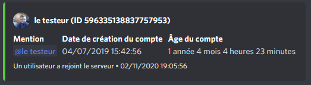
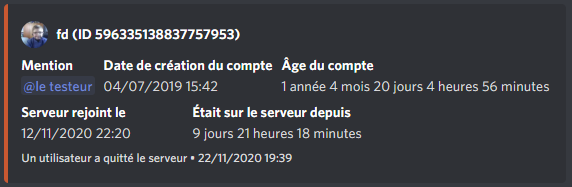
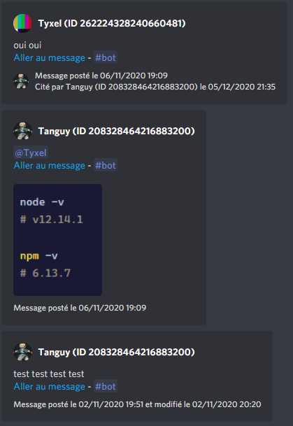
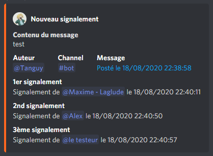

# Le-bot-en-JS

[](https://github.com/TanguyChiffoleau/Le-bot-en-JS/releases)
[](https://github.com/TanguyChiffoleau/Le-bot-en-JS/blob/146c5cc906dfc667edffe384e225e4dab689bd0a/package.json#L23)
[](https://github.com/TanguyChiffoleau/Le-bot-en-JS/actions?query=workflow%3A%22Node.js+CI%22+event%3Apush)

## Table des matières

- [Table des matières](#table-des-matières)
- [À propos](#à-propos)
- [Setup en production](#setup-en-production)
	- [Setup avec Node.js](#setup-avec-nodejs)
	- [Setup dans un container avec Docker et Docker Compose](#setup-dans-un-container-avec-docker-et-docker-compose)
- [Ressources](#ressources)
- [Contribuer](#contribuer)

## À propos

Le-bot-en-JS est un bot discord open-source codé en JS conçu principalement et spécialement pour le serveur discord **Entraide Informatique - Capet & CTRL-F**.

[](https://www.discord.gg/informatique)


<!-- ## Commandes

> Pour avoir toutes les informations sur une commande, utliser la commande `<prefix>help <commande>`.
>
> Exemple : `!help coinflip`.


### Divers

| Commande | Description                                                 |
| -------- | ----------------------------------------------------------- |
| coinflip | Coinflip! (pile ou face)                                    |
| help     | Affiche les commandes fixes du bot                          |
| infos    | Donne quelques infos sur le bot                             |
| ping     | Donne le ping de l'API ainsi que du bot                     |
| roles    | Affiche le nombre de membres pour chaque rôle               |
| votes    | Créer un embed avec la proposition et des émojis pour voter |
| whois    | Donne des infos sur soit ou un autre utilisateur            |

### Modération

| Commande | Description                                          |
| -------- | ---------------------------------------------------- |
| clean    | Supprime un nombre de messages donné dans le channel |
| cooldown | Active le mode lent sur le channel                   |


## Fonctionnalités

### Logs

- Join/leave des membres :

  
  
- Messages supprimés : TO BE DONE (ne pas oublier les screenshots/gifs)

### Rename des utilisateurs à pseudo incorrect

- Déclenché lors des events suivants : un utilisateur rejoint les serveur, un utilisateur envoie un message, un utilisateur est modifié et lorsque le pseudo matche le regex `/^[^a-zA-Z0-9áàâäãåçéèêëíìîïñóòôöõúùûüýÿæœÁÀÂÄÃÅÇÉÈÊËÍÌÎÏÑÓÒÔÖÕÚÙÛÜÝŸÆŒ].*/`
- Renomme en "Change ton pseudo"

### Citations

- Poste un embed avec le contenu d'un message lorsqu'un lien pointant vers un message discord du serveur est reçu.



### Système de report

- Poste un embed avec des informations sur le message signalé et sur le(s) signalement(s) :
  - contenu/channel/date et lien vers le message
  - auteurs 


-->

## Setup en production

L'application est capable de tourner sous plusieurs environnements :

-   n'importe quel environnement avec Node.js d'installé
-   dans un container Docker avec Docker Compose

### Setup avec Node.js

#### Prérequis

1. Il est nécessaire d'avoir [Node.js](https://nodejs.org/fr/) 12.0.0 ou plus récent d'installé sur votre machine.

	> Utilisez la commande `node -v` pour vous assurez que Node est bien installé et que sa version est suffisante.

	> À titre indicatif, l'application tourne sous Node.js v14.16.0 en production.

2. Téléchargez le code de l'application sur votre machine. _cf. [Télécharger le code de l'application sur votre machine](#download)_

3. Il faut au préalable installer les dépendences de l'application avant de la lancer celle-ci en utilisant la commande `npm i`.

	> Toutes les dépendences vont être installés, y compris celles prévus pour les développeurs, car le package [dotenv](https://www.npmjs.com/package/dotenv) est nécessaire. Ci toutefois vous avez appliqué les variables d'environnement à l'application par vos propres moyens, seule la commande `npm i --production` est nécessaire.

4. Renommez le fichier `bot.example.env` en `bot.env`, puis modifier les variables d'environnement pour que l'application fonctionne correctement. _cf. [Variables d'environnement](#environnement)_

5. Renommez le fichier `reactionRoleConfig.example.json` en `reactionRoleConfig.json`, puis modifier son contenu pour que le système fonctionne correctement. _cf. [Variables d'environnement](#environnement)_

#### Lancement et arrêt de l'application

-   Vous pouvez utiliser `npm start` pour lancer l'application.

-   Vous pouvez utiliser la combinaison de touches Ctrl+C ou fermer la fenêtre de commandes pour tuer l'application.

> Vous pouvez utiliser un gestionnaire d'application comme [PM2](https://pm2.keymetrics.io/) pour faciliter la gestion de l'application. _cf. [ Managing your bot process with PM2](https://discordjs.guide/improving-dev-environment/pm2.html)_


### Setup dans un container avec Docker et Docker Compose

#### Prérequis

1. Il est nécessaire d'avoir [Docker](https://docs.docker.com/get-docker/) ainsi que [Docker Compose](https://docs.docker.com/compose/install/) d'installé.
	> Utilisez les commandes `docker -v` et `docker-compose -v` pour vérifier que les deux applications soient bien installés.

2. Créez les fichiers `bot.env` et `reactionRoleConfig.json` dans le dossier `config` ainsi que le fichier `docker-compose.yml` dans le dossier `docker` :
	```bash
	mdkir config
	cd config
	touch bot.env reactionRoleConfig.json
	cd ..
	mkdir docker
	touch docker-compose.yml
	```

   - Configurez le fichier `bot.env` en ajoutant les variables d'environnement pour que l'application fonctionne correctement. _cf. [Variables d'environnement](#environnement)_


   - Configurez le fichier `reactionRoleConfig.json`, puis modifiez le fichier pour que le système fonctionne correctement. _cf. [Configuration du sytème de réaction/rôles](#reaction)_

   - Copiez le contenu du fichier [docker/docker-compose.yml](docker/docker-compose.yml) dans le fichier du même emplacement sur votre machine. Il correspond au fichier de configuration pour `docker-compose`.

> La structure des dossiers et fichiers devrait ressembler à ça :
> ```
> .
> ├── config
> │   ├── bot.env
> │   └── reactionRoleConfig.json
> └── docker
> 	  └── docker-compose.yml
> ```

#### Lancement de l'application

-   Vous pouvez utiliser les commandes `docker pull tanguychiffoleau/le-bot-en-js:latest` puis `docker-compose -f ./docker/docker-compose.yml up -d` pour lancer l'application.

> docker pull va télécharger ou mettre à jour si besoin l'image de l'application hébergée sur [Docker Hub](https://hub.docker.com/repository/docker/tanguychiffoleau/le-bot-en-js). Le tag ici est `latest` ce qui correspond, de fait, au code présent sur la branche [master](https://github.com/TanguyChiffoleau/Le-bot-en-JS/tree/master/). Vous pouvez spécifier une version spécifique comme par exemple `2.0.0`. _cf. [liste des tags disponibles](https://hub.docker.com/repository/registry-1.docker.io/tanguychiffoleau/le-bot-en-js/tags?page=1) ainsi que leur [version correspondante](https://github.com/TanguyChiffoleau/Le-bot-en-JS/releases)_

> docker-compose va lancer le container avec les règles définies dans `docker-compose.yml`.

> Pour plus d'infos sur les technologies liées à Docker utilisées ici, vous pouvez consulter leur [documentation](https://docs.docker.com/reference/) ou leur [manuel](https://docs.docker.com/engine/).

#### Arrêt de l'application

-   Vous pouvez utiliser la commande `docker-compose -f ./docker/docker-compose.yml stop` pour stopper le container. Pour le supprimer, utilisez la commande `docker-compose -f ./docker/docker-compose.yml down`.

<!-- <details>
<summary id="docker"><b>Setup avec Docker</b></summary>

#### Prérequis

1. Il est nécessaire d'avoir [Docker](https://docs.docker.com/get-docker/) d'installé.

	> Utilisez la commandes `docker -v` pour vérifier que l'application soit bien installé.

2. Téléchargez le code de l'application sur votre machine. _cf. [Télécharger le code de l'application sur votre machine](#download)_

3. Renommer le fichier `bot.example.env` en `bot.env`, puis modifier les variables d'environnement pour que l'application fonctionne correctement. _cf. [Variables d'environnement](#environnement)_

	> Seul le dossier `config` avec les fichiers `bot.env` et `reactionRoleConfig.json` ainsi que le dossier `docker` avec le fichier `docker-compose.yml` sont nécessaires, en effet, le code sera lui directement intégré dans l'image docker. Vous pouvez supprimer les autres dossiers et fichiers si vous le souhaitez.

	> La structure des dossiers et fichiers devrait ressembler à ça :
	>
	> ```
	> .
	> ├── config
	> │   ├── bot.env
	> │   └── reactionRoleConfig.json
	> └── docker
	> 	  └── docker-compose.yml
	> ```

#### Lancement de l'application

-   Vous pouvez utiliser les commandes `docker pull tanguychiffoleau/le-bot-en-js:latest` puis `docker run --env NODE_ENV=production --env-file config/bot.env --volume /config/:/config/ --restart on-failure -d tanguychiffoleau/le-bot-en-js:latest` pour lancer l'application.

	> docker pull va télécharger ou mettre à jour si besoin l'image de l'application hébergée sur [Docker Hub](https://hub.docker.com/repository/docker/tanguychiffoleau/le-bot-en-js). Le tag ici est `latest` ce qui correspond, de fait, au code présent sur la branche [master](https://github.com/TanguyChiffoleau/Le-bot-en-JS/tree/master/). Vous pouvez spécifier une version spécifique comme par exemple `2.0.0`. _cf. [liste des tags disponibles](https://hub.docker.com/repository/registry-1.docker.io/tanguychiffoleau/le-bot-en-js/tags?page=1) ainsi que leur [version correspondante](https://github.com/TanguyChiffoleau/Le-bot-en-JS/releases)_

	> Pour plus d'infos sur les technologies liées à Docker utilisées ici, vous pouvez consulter leur [documentation](https://docs.docker.com/reference/) ou leur [manuel](https://docs.docker.com/engine/).

#### Arrêt de l'application

-   Vous pouvez utiliser la commande `docker-compose -f ./docker/docker-compose.yml stop` pour stopper le container. Pour le supprimer, utilisez la commande `docker-compose -f ./docker/docker-compose.yml down`.

</details> -->

## Ressources

</details>

<details id='download'>
<summary><b>Télécharger le code de l'application sur votre machine</b></summary>

Vous pouvez télécharger le code de l'application sur votre machine

-   en [clonant le repository](https://docs.github.com/en/free-pro-team@latest/github/creating-cloning-and-archiving-repositories/cloning-a-repository)
-   ou en téléchargeant le code source


</details>

<details id='environnement'>
<summary><b>Variables d'environnement</b></summary>

Le bot repose sur les variables d'environnement pour pouvoir fonctionner.

#### Fichier bot.env

> Exemple disponible [ici](config/bot.example.env) :
> ```env
> DISCORD_TOKEN="DISCORD-SECRET-BOT-TOKEN"
> COMMANDS_PREFIX="!"
> GUILD_ID="123456789012345678"
> LEAVE_JOIN_CHANNEL_ID="123456789012345678"
> REPORT_CHANNEL="123456789012345678"
> LOGS_CHANNEL="123456789012345678"
> VOICE_MANAGER_CHANNELS_IDS="123456789012345678", "123456789012345678", "123456789012345678"
> ```

| Variable                   | Description                                                                                                      |
| -------------------------- | ---------------------------------------------------------------------------------------------------------------- |
| DISCORD_TOKEN              | [Token secret du bot discord](https://discordjs.guide/preparations/setting-up-a-bot-application.html#your-token) |
| COMMANDS_PREFIX            | Préfixe utilisé pour intéragir avec le bot                                                                       |
| GUILD_ID                   | ID du serveur (= guild) sur lequel le bot est utilisé                                                            |
| LEAVE_JOIN_CHANNEL_ID      | ID du channel sur lequel les messages de départs/arrivées seront postés                                          |
| REPORT_CHANNEL             | ID du channel sur lequel les messages de signalement seront postés                                               |
| LOGS_CHANNEL               | ID du channel sur lequel les messages de logs seront postés                                                      |
| VOICE_MANAGER_CHANNELS_IDS | ID des channels vocaux utilisés pour le système de vocaux personnalisés. Les ID doivent être séparés par une virgule    |

> Pour pouvoir récupérer les identifiants (ID) sur discord, il faut [activer le mode développeur](https://support.discord.com/hc/fr/articles/206346498-O%C3%B9-trouver-l-ID-de-mon-compte-utilisateur-serveur-message-).

</details>

</details>

<details id='reaction'>
<summary><b>Configuration du sytème de réaction/rôles</b></summary>

#### Fichier reactionRoleConfig.json

> Exemple disponible [ici](config/reactionRoleConfig.example.json) :
> ```js
> [
> 	// Message n°1
> 	{
> 		"channelId": "123456789123456789", // ID du channel du message
> 		"messageId": "123456789123456789", // ID du message
> 		"emojiRoleMap": {
> 			// Émoji unicode en clé et ID du rôle en valeur
> 			"💸": "123456789123456789", 
> 			"🔧": "123456789123456789"
> 		}
> 	},
> 
> 	// Message n°2
> 	{
> 		"channelId": "987654321987654321", // ID du channel du message
> 		"messageId": "123456789123456789", // ID du message
> 		"emojiRoleMap": {
> 			// ID de l'émoji custom en clé et ID du rôle en valeur
> 			"987654321987654322": "987654321987654321",
> 			"987654321987654321": "987654321987654321"
> 		}
> 	}
> ]
> ```

> Pour pouvoir récupérer les identifiants (ID) sur discord, il faut [activer le mode développeur](https://support.discord.com/hc/fr/articles/206346498-O%C3%B9-trouver-l-ID-de-mon-compte-utilisateur-serveur-message-).

> Pour désactiver le système, le fichier doit être composé d'un tableau (array) **vide** :
> ```js
> []
> ```

-  Pour récupérer les émojis :
   - unicode : mettre un `\` avant l'émoji. Exemple : pour `:white_check_mark:`, l'émoji unicode est `✅`. 

   - personnalisés : mettre un `\` avant l'émoji et récupérer l'ID. Exemple : pour `\<:lul:719519281682972703>`, l'ID est `719519281682972703`. 

</details>

## Contribuer

Regardez le [guide de contribution](./.github/CONTRIBUTING.md) si vous voulez soumettre une pull request.
